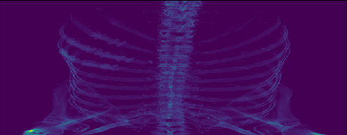
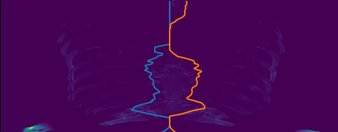
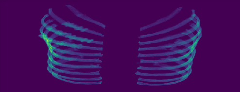
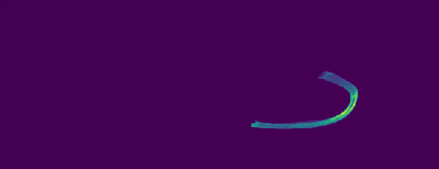

## Refed

**Refed (Rib Extaction and Fracture Detection Model)** by [Youyou Jiang](jiangyy5318@gmail.com) and [Shiye Lei](leishiye@gmail.com) in AI lab, [Matrix Inc](https://www.matrix.io). Our model has a great performance on **extracting ribs** and **detecting fracture** from CT images. The model is based on python 3.6. 

Refed is consist by two modules: **rib extraction module** and **fracture detection module**. *First*, we design algorithm based on computer vision for extracting ribs from CT images. *Second*, we design DNN based on [faster-rcnn](https://github.com/endernewton/tf-faster-rcnn) for detecting fracture location with these ribs.

### Performance
---
#### rib extraction module: extract ribs from source CT image
1. *Input CT image*

**Note**: the source CT image is handled by HU value binary process (HU threshold = 400)

2. *Cut sternum with envelope line*

3. *remaining spine*

4. *collect ribs*

you can also view every single rib as follows:

---
- **operation system**: Linux (our OS is Ubuntu 16.04)
- **interpreter**: More advanced than python 3.6.0
- **some python packages**: [`skimage`](https://scikit-image.org/), [`opencv`](https://opencv.org/), [`tensorflow`](https://www.tensorflow.org/), [`sklearn`](https://scikit-learn.org/)

### Note
REFED is still in progress. So we cannot open source code of REFED due to business reasons. If you are intereted in the program and want to to more details, please send an e-mail to me. Thanks for your understanding.
